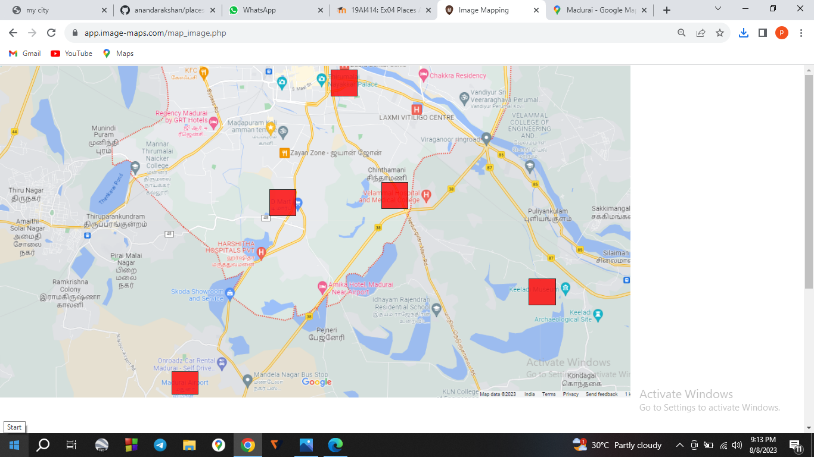
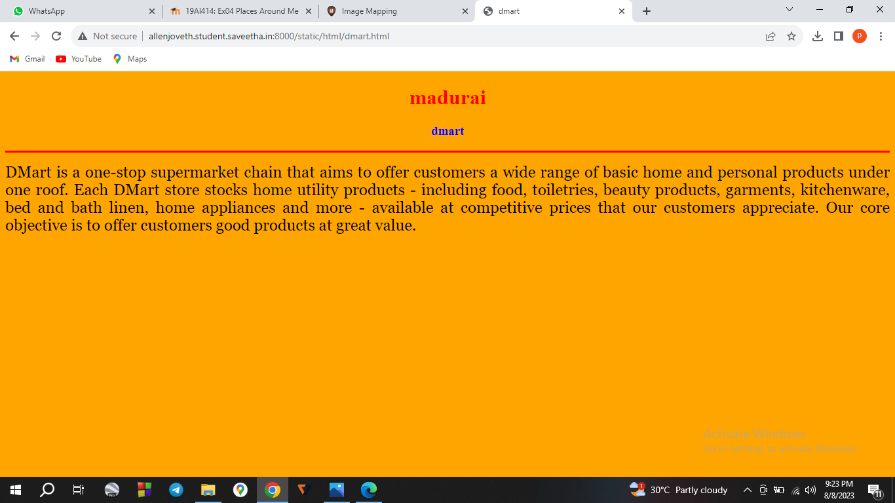
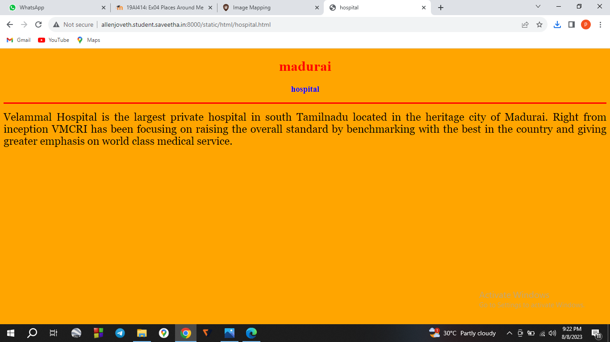
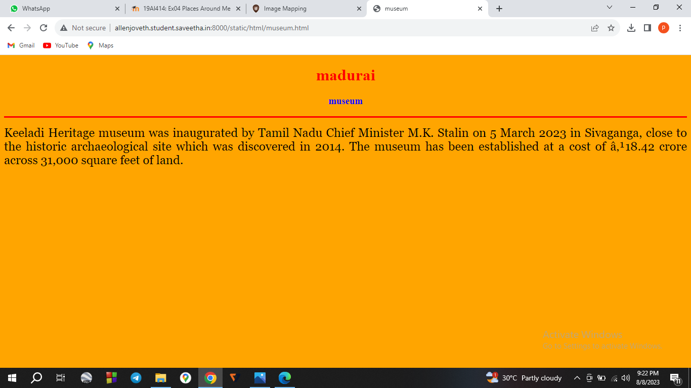
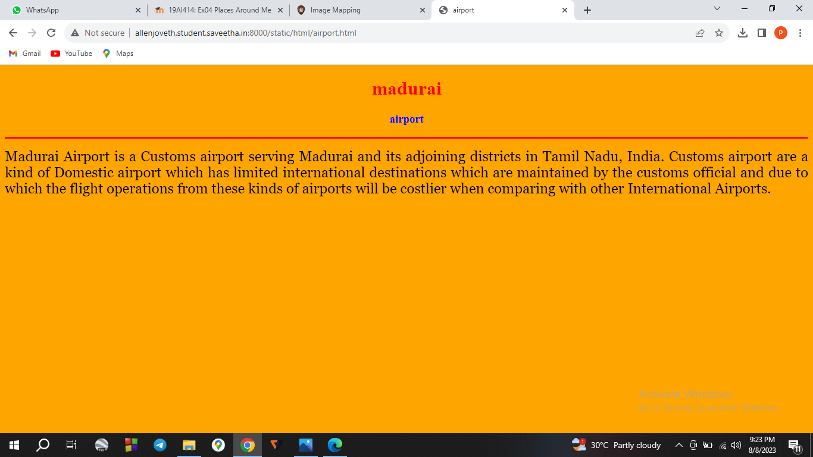
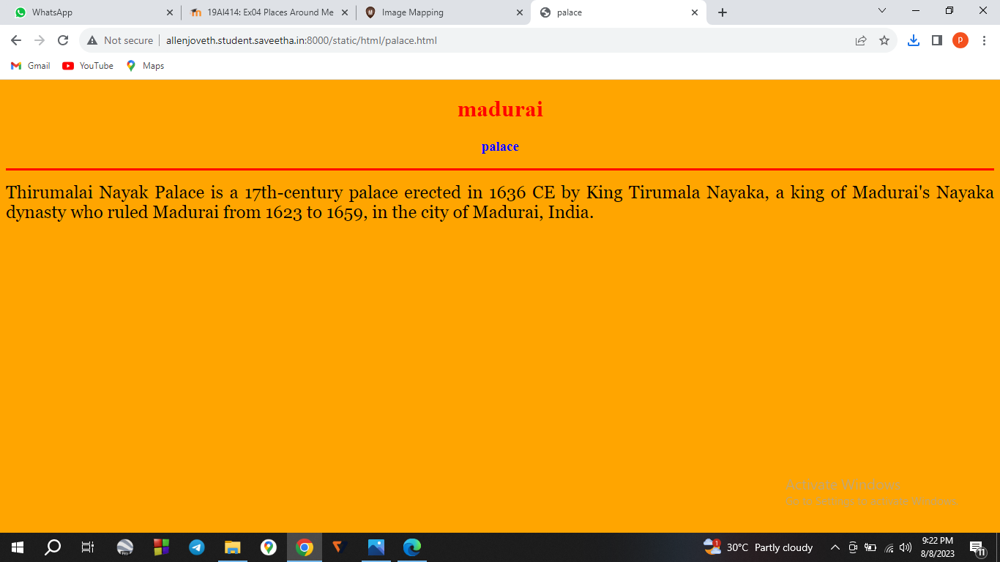
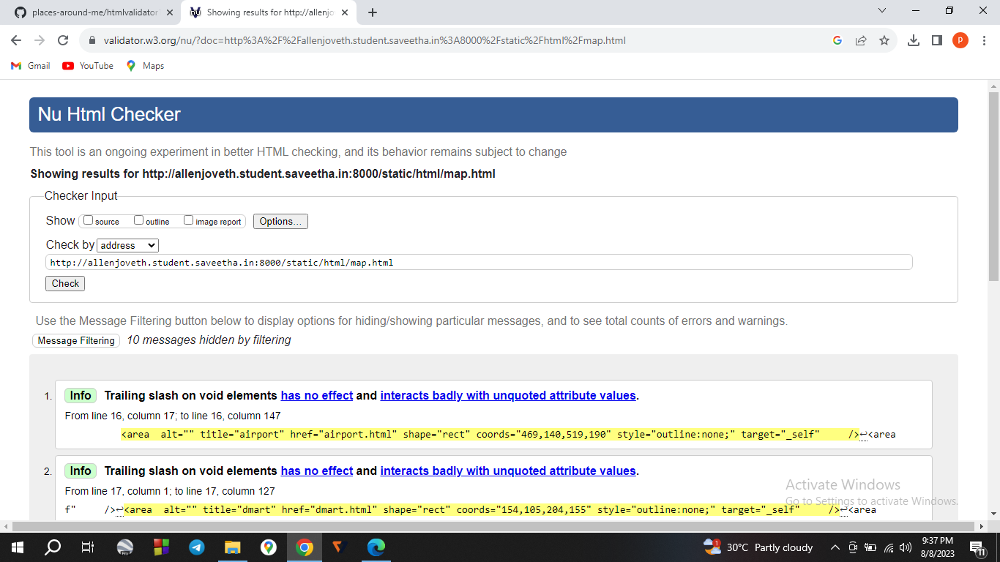
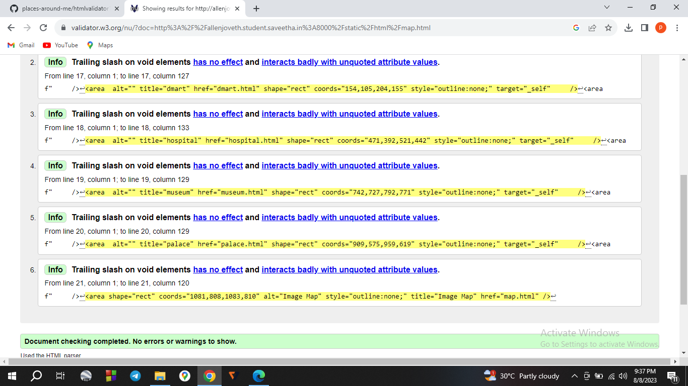

# Places Around Me
## AIM:
To develop a website to display details about the places around my house.

## Design Steps:

STEP 1
Create a Django admin interface.

STEP 2
Download your city map from Google.

STEP 3
Using <map> tag name the map.

STEP 4
Create clickable regions in the image using <area> tag.

STEP 5
Write HTML programs for all the regions identified.

STEP 6
Execute the programs and publish them.

## Code:
map.html
```py
<!DOCTYPE html>
<html lang="en">
    <head>
        <title>my city</title>
    </head>
    <body bgcolor="cyan">
        <h1 align="center">
            <font color="red"><b>map.html</b></font>
        </h1>
        <h3 align="center">
            <font color="blue"><b>Allen Joveth (23009582)</b></font>
        </h3>
        <center>
            
            <map name ="My City">
                <area  alt="" title="airport" href="airport.html" shape="rect" coords="469,140,519,190" style="outline:none;" target="_self"     />
<area  alt="" title="dmart" href="dmart.html" shape="rect" coords="154,105,204,155" style="outline:none;" target="_self"     />
<area  alt="" title="hospital" href="hospital.html" shape="rect" coords="471,392,521,442" style="outline:none;" target="_self"     />
<area  alt="" title="museum" href="museum.html" shape="rect" coords="742,727,792,771" style="outline:none;" target="_self"     />
<area  alt="" title="palace" href="palace.html" shape="rect" coords="909,575,959,619" style="outline:none;" target="_self"     />
<area shape="rect" coords="1081,808,1083,810" alt="Image Map" style="outline:none;" title="Image Map" href="map.html" />
            </map>
        </center>
    </body>
</html>
```
airport.html
```py
<!DOCTYPE html>
<html lang="en">
<head>
<title>airport</title>
</head>
<body bgcolor="orange">
<h1 align="center">
<font color="red"><b>madurai</b></font>
</h1>
<h3 align="center">
<font color="blue"><b>airport</b></font>
</h3>
<hr size="3" color="red">
<p align="justify">
<font face="Georgia" size="5">
    Madurai Airport is a Customs airport serving Madurai and its adjoining districts in Tamil Nadu, India. Customs airport are a kind of Domestic airport which has limited international destinations which are maintained by the customs official and due to which the flight operations from these kinds of airports will be costlier when comparing with other International Airports.
</font>
</p>
</body>
</html>
```
dmart.html
```py
<!DOCTYPE html>
<html lang="en">
<head>
<title>dmart</title>
</head>
<body bgcolor="orange">
<h1 align="center">
<font color="red"><b>madurai</b></font>
</h1>
<h3 align="center">
<font color="blue"><b>dmart</b></font>
</h3>
<hr size="3" color="red">
<p align="justify">
<font face="Georgia" size="5">
     DMart is a one-stop supermarket chain that aims to offer customers a wide range of basic home and personal products under one roof. Each DMart store stocks home utility products - including food, toiletries, beauty products, garments, kitchenware, bed and bath linen, home appliances and more - available at competitive prices that our customers appreciate. Our core objective is to offer customers good products at great value.
</font>
</p>
</body>
</html>
```
hospital.html
```py
<!DOCTYPE html>
<html lang="en">
<head>
<title>hospital</title>
</head>
<body bgcolor="orange">
<h1 align="center">
<font color="red"><b>madurai</b></font>
</h1>
<h3 align="center">
<font color="blue"><b>hospital</b></font>
</h3>
<hr size="3" color="red">
<p align="justify">
<font face="Georgia" size="5">
    Velammal Hospital is the largest private hospital in south Tamilnadu located in the heritage city of Madurai. Right  from inception VMCRI has been focusing on raising the overall standard by benchmarking with the best in the country and giving greater emphasis on world class medical service.
</font>
</p>
</body>
</html>
```
museum.html
```py
<!DOCTYPE html>
<html lang="en">
<head>
<title>museum</title>
</head>
<body bgcolor="orange">
<h1 align="center">
<font color="red"><b>madurai</b></font>
</h1>
<h3 align="center">
<font color="blue"><b>museum</b></font>
</h3>
<hr size="3" color="red">
<p align="justify">
<font face="Georgia" size="5">
    Keeladi Heritage museum was inaugurated by Tamil Nadu Chief Minister M.K. Stalin on 5 March 2023 in Sivaganga, close to the historic archaeological site which was discovered in 2014. The museum has been established at a cost of ₹18.42 crore across 31,000 square feet of land. 
</font>
</p>
</body>
</html>
```
palace.html
```py
<!DOCTYPE html>
<html lang="en">
<head>
<title>palace</title>
</head>
<body bgcolor="orange">
<h1 align="center">
<font color="red"><b>madurai</b></font>
</h1>
<h3 align="center">
<font color="blue"><b>palace</b></font>
</h3>
<hr size="3" color="red">
<p align="justify">
<font face="Georgia" size="5">
  Thirumalai Nayak Palace is a 17th-century palace erected in 1636 CE by King Tirumala Nayaka, a king of Madurai's Nayaka dynasty who ruled Madurai from 1623 to 1659, in the city of Madurai, India.
</font>
</p>
</body>
</html>
```


## Output:







## HTML Validator:



## Result:
The program is completed successfully.